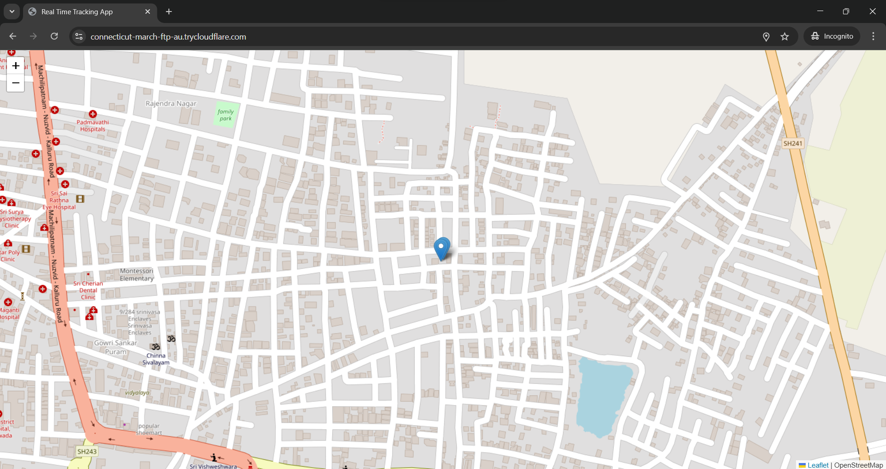

# 🌍 Real-Time Location Tracker

A Node.js + Socket.IO + Leaflet.js app for real-time location sharing — like WhatsApp Live Location or Swiggy-style delivery tracking.

## 🔧 Tech Stack

- **Backend:** Node.js, Express, Socket.IO
- **Frontend:** Leaflet.js, HTML/CSS, EJS
- **Realtime:** WebSockets via Socket.IO
- **Map Tiles:** OpenStreetMap

---

## 📸 Screenshot



---

## 🚀 Features

- Live location sharing with high accuracy (via `navigator.geolocation`)
- Real-time map updates using WebSockets
- Auto-centering on latest location
- Clean Leaflet map with OpenStreetMap tiles
- Multi-user support with markers

---

## 🛠️ How to Run Locally

1. **Clone the repo:**

```bash
git clone https://github.com/syam-bukkuru/Real_Time_Tracker.git
cd Real_Time_Tracker
```
2. **Install dependencies:**
```bash
npm install
# This installs: express, socket.io, and ejs
```

3. **Start the app:**
```bash
node app.js
```

4. Open http://localhost:3000 in your browser.
